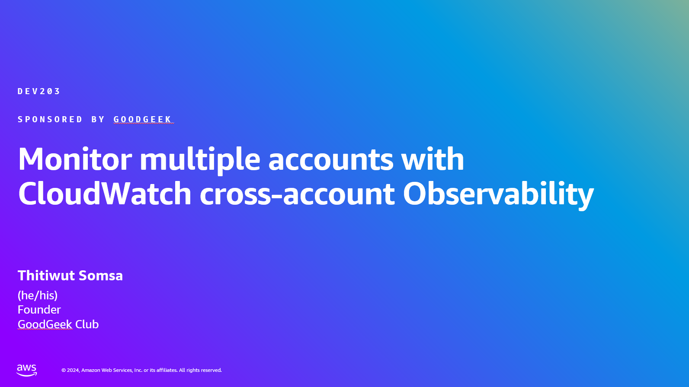

# Serverless CloudWatch Monitoring Cross Account



This repo is part of AWS Summit Bangkok 2024 at 30 May 2024.

- [The presentation](https://docs.google.com/presentation/d/1sI5gvI13iF6mo3RT-yUZgG_c9hG42VUm/edit?usp=drive_link&ouid=117377256572461095430&rtpof=true&sd=true)
- [Configuration](https://youtu.be/EQK6Zg13oKc)

## Overview

AWS CloudWatch monitoring cross accounts need 2 type of accounts
- Monitoring Account
- Source Accounts

The **Source Accounts** are metric and log data publisher to **Monitoring Account**
This project is source account data publisher with **AWS Lambda**. It will feed healthy status to metric and log.


## Prerequisites
- [AWS CLI](https://docs.aws.amazon.com/cli/latest/userguide/)
- [NodeJS version 16+](https://nodejs.org/)
- [NPM](https://www.npmjs.com/)

## Setup
Install node package
```bash
npm install
```

### Configure AWS Profile

Config profile `demo-dev` to deploy to development account
```sh
 aws configure --profile demo-dev
```

Config profile `demo-prod` to deploy to production account
```sh
 aws configure --profile demo-dev
```

## Usage

### Service config

All related configs are in `.env` file

**.env.example**
```txt
HEALTH_PERCENT=60
CRON_RATE="15 minutes"
CRON_ENABLE=true
MONITOR_ACCOUNT_ID=9999988887771
SINK_IDENTIFIER=arn:aws:oam:ap-southeast-1:9999988887771:sink/86d9f5c6-b5c5-4b4d-b3d1-abcdefghia62
```

### Run locally

run service locally with `serverless-offline`

```bash
npm run start
```

### Deploy to environment
```bash
npm run deploy:dev
```

```bash
npm run deploy:prod
```

## Resources
- https://www.youtube.com/watch?v=bfyThV6eSdg
- https://www.youtube.com/watch?v=UbBZk9aCYj8
- https://docs.aws.amazon.com/AmazonCloudWatch/latest/monitoring/CloudWatch-Unified-Cross-Account-Setup.html#Unified-Cross-Account-SetupSource-OrgTemplate
